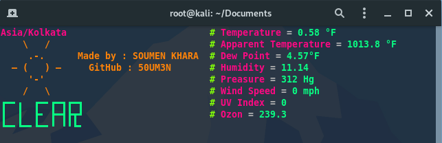

# Weather
Simple Shell Script to get the information about weather in your location.
# Usage
Create account on https://darksky.net
Then copy you API key, then past

    # API="pest here"
    
Then run the file name weather.sh

    # bash weather.sh
  
# Screenshot
  
